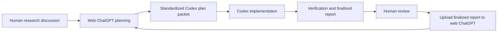

# PINO Codex and ChatGPT Research Workflow SOPs

This repository documents a repeatable operating workflow for using web-based ChatGPT and Codex to support research planning, implementation, verification, review, and iterative modification.

The workflow is designed to reduce ambiguity between human planning, ChatGPT-generated implementation instructions, Codex execution, and subsequent review cycles.

## Purpose

The goal of these SOPs is to define a closed-loop research-assistance process:

1. A human researcher discusses goals, constraints, and tradeoffs with web-based ChatGPT.
2. ChatGPT generates a standardized Codex plan packet.
3. Codex loads the packet in a consistent order and executes the scoped task.
4. The human reviews Codex output, verification results, and the finalized report.
5. The finalized report is uploaded back to web-based ChatGPT as context for the next modification cycle.
6. ChatGPT generates the next plan packet using the reviewed report and current project truth.

This process separates planning, execution, evidence review, and context refresh so that each iteration has a clear input, output, and acceptance gate.

## Documents

| Document | Purpose |
|---|---|
| [`Codex_SOP.md`](Codex_SOP.md) | Main SOP for Codex-assisted research tasks, implementation workflow, evidence handling, closeout, and ChatGPT context refresh. |
| [`PINO_PLAN_SOURCE_GUIDE.md`](PINO_PLAN_SOURCE_GUIDE.md) | Source guide used by web-based ChatGPT to generate compact, standardized Codex plan packets. |

## Core Workflow



## Roles

### Human researcher

The human researcher owns the research objective, acceptance criteria, final interpretation, and decision to accept or reject results.

### Web-based ChatGPT

ChatGPT helps convert human discussion into a standardized plan packet. It should use current project context, the finalized report from the previous cycle, and the plan-source guide to produce Codex-ready instructions.

### Codex

Codex executes the standardized plan packet against the repository. It should make scoped edits, run the required verification gates, and produce a closeout report suitable for human review and future ChatGPT context upload.

## Standard Codex Plan Packet

Implementation packets should use this required file set:

```text
PLAN.md
CONTEXT_LOAD.md
CODEX_PROMPT.md
ACCEPTANCE_GATES.md
DECISION_IMPACT.md
REFERENCE_UPDATES.md
CLOSEOUT.md
```

Codex should start from these files in this order:

```text
CONTEXT_LOAD.md
PLAN.md
CODEX_PROMPT.md
ACCEPTANCE_GATES.md
```

Optional appendices may be added only when they are needed for the task, such as experiment, audit, interface, assistant, migration, risk, or human-review specifications.

## Recommended Repository Layout

```text
docs/
  workflows/
    Codex_SOP.md
    PINO_PLAN_SOURCE_GUIDE.md
  plans/
    active/
    archive/
  reports/
  reference/
  context/
    packs/
```

Generated outputs, temporary results, model checkpoints, local figures, private notes, and raw experiment artifacts should not be committed unless they are explicitly approved for publication.

## How to Use These SOPs

### 1. Start a planning discussion

Discuss the intended research or implementation change with web-based ChatGPT. Include the current objective, relevant constraints, known risks, and any previous finalized report.

### 2. Generate a Codex plan packet

Ask ChatGPT to generate a plan packet using the source guide. The packet should be compact, scoped, and formatted consistently so Codex can process it without relying on informal chat history.

### 3. Execute with Codex

Load the plan packet into Codex. Codex should follow the packet, make minimal necessary changes, and run the acceptance gates listed in the packet.

### 4. Review the finalized report

The human researcher reviews the Codex output, changed files, verification results, caveats, and unresolved issues.

### 5. Refresh ChatGPT context

Upload the finalized report to web-based ChatGPT before requesting the next plan. The uploaded report becomes reviewed context for subsequent modifications, but it should not override executable truth, current reference documents, or verified repository state.


## Maintenance Notes

When the workflow changes, update the SOP first. When the standardized Codex packet contract changes, update the source guide. If both documents change, confirm that the SOP’s handoff workflow and the source guide’s required packet structure remain consistent.

## License

All Codex workflows and SOP documents in this project are licensed under the [CC BY 4.0 (Creative Commons Attribution 4.0 International License)](http://creativecommons.org/licenses/by/4.0/).

[![CC BY 4.0][cc-by-shield]][cc-by]

[cc-by]: http://creativecommons.org/licenses/by/4.0/
[cc-by-shield]: https://img.shields.io/badge/License-CC%20BY--4.0-lightgrey.svg
